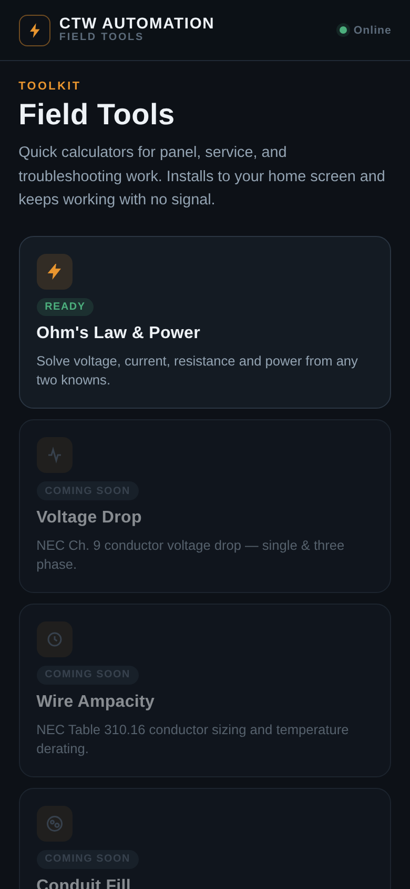
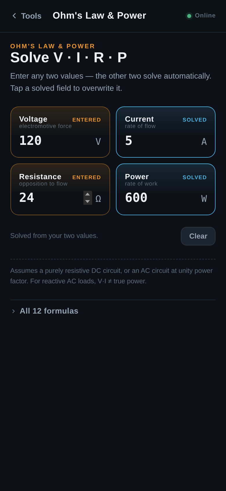

# Electricians Calculator

An installable, offline-capable PWA calculator toolkit for electricians. No build step, no framework, no backend — a single HTML file plus a manifest and service worker.

**Live demo:** https://claude.ai/artifact/6xdGUDpFCCatopGvZkDChM



## What's here

- **Ohm's Law & Power** — enter any two of Voltage, Current, Resistance, or Power; the other two solve live using all 12 Ohm's/Watt's law formulas. Values auto-format with SI prefixes (mA, kΩ, etc.), and a collapsible reference shows the full formula wheel.



### Roadmap

The home screen is a registry (`TOOLS` in `index.html`) with a few more field tools stubbed in as "coming soon":

- Voltage Drop — NEC Ch. 9 conductor voltage drop, single & three phase
- Wire Ampacity — NEC Table 310.16 conductor sizing & derating
- Conduit Fill — NEC Ch. 9 Table 4/5 raceway fill percentage
- Box Fill — NEC 314.16 device box volume fill

Adding a new tool means adding an entry to `TOOLS`, a new `<section class="view">`, and a route in `views` — the shell (header, back button, install prompt, offline caching) is already wired up to handle it.

## PWA features

- **Installable** — `manifest.json` + `sw.js` make it installable to a phone or desktop home screen (Chrome/Android shows an in-app "Install app" button; iOS uses Share → Add to Home Screen).
- **Offline-first** — the service worker caches the app shell on first load, so it keeps working with no signal once it's been opened once.
- **No dependencies** — fonts load from Google Fonts (Oswald / Manrope / JetBrains Mono); everything else is plain HTML/CSS/JS in `index.html`.

## Local development

Just serve the folder over HTTP (service workers require a real origin, not `file://`):

```bash
python3 -m http.server 8080
# open http://localhost:8080
```

To regenerate the app icons:

```bash
pip install pillow
python3 scripts/make_icons.py
```

## Structure

```
index.html              # entire app: markup, styles, and logic
manifest.json            # PWA manifest
sw.js                     # service worker (app-shell caching)
icon-192.png, icon-512.png, icon-32.png, apple-touch-icon.png
scripts/make_icons.py    # regenerates the icons above
docs/                     # README screenshots
```

## License

MIT — see [LICENSE](LICENSE).

---

Built by [CTW Automation](https://ctw-automation.com).
